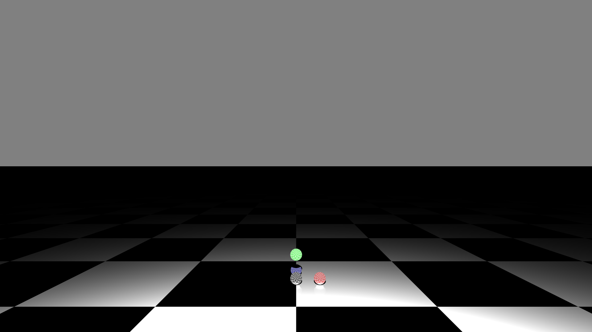

# Raytracing

> c++ raytracing from scratch



This program generates a ray-traced image using basic c++ stl libraries. Scenes are loaded from a text-based file-format using a python script to interpret the protocol and help the c++ program parse the input. This program is capable of outputting images to the PPM file-format, from which another program can be used to convert to other, modern formats such as PNG, JPEG, TIFF, etc. Future plans include expansion to support BMP output.

## TO-DO
 - round vs floor for fragments in checkeredPlane and checkeredSphere
 - add BMP format

## Installation/Operation

The compilation using `clang` is controlled through `make`.

### Dependencies

-   `clang`
-   `make`
-   `doxygen`
-   `python3`

### Commands

On UNIX based systems, the program can be compiled by running

```shell
make
```

and executed with

```shell
./raytracing input_file.scene.stream output_file.ppm
```
A `*.scene` file can be formatted to the `*.scene.stream` file through
```shell
python3 scene.py input_file.scene
```

The documentation can be generated by running

```shell
doxygen Doxyfile
```

## Resources

-   Repository: https://github.com/NC03/raytracing
-   Documentation: https://nc03.github.io/raytracing/
-   Implementation based on [slides](https://www.cs.utexas.edu/~theshark/courses/cs354/lectures/cs354-4.pdf)

## About

Created by [NC03](https://nc03.github.io/)
